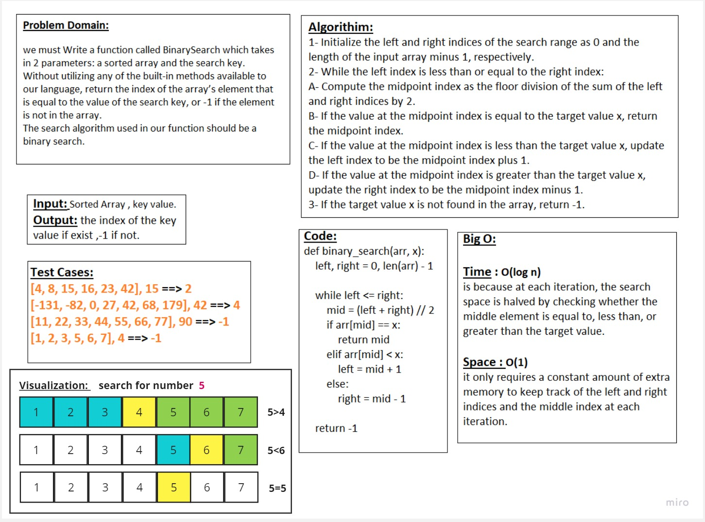

```
Navigator: Moath shakhatreh
Driver: Husam Obeidat
```
# Problem : array-binary-search

* A binary search is an algorithm to find a particular element in the list.
* Suppose we have a list of thousand elements,and we need to get an index position of a particular element.
* We can find the element's index position very fast using the binary search algorithm.

---

## Concept of Binary Search

we can find the element position using the following methods.

* Recursive Method
* Iterative Method

The divide and conquer approach technique is followed by the recursive method. In this method, a function is called itself again and again until it found an element in the list.

A set of statements is repeated multiple times to find an element's index position in the iterative method. The while loop is used for accomplish this task.

Binary search is more effective than the linear search because we don't need to search each list index. The list must be sorted to achieve the binary search algorithm.

Let's have a step by step implementation of binary search.

We have a sorted list of elements, and we are looking for the index position of 45.

> [12, 24, 32, 39, 45, 50, 54]

So, we are setting two pointers in our list. One pointer is used to denote the smaller value called low and the second pointer is used to denote the highest value called high.

Next, we calculate the value of the middle element in the array.

>mid = (low+high)/2  
Here, the low is 0 and the high is 7.  
mid = (0+7)/2  
mid = 3 (Integer)  

Now, we will compare the searched element to the mid index value. In this case, **32** is not equal to **45**. So we need to do further comparison to find the element.

If the number we are searching equal to the **mid**. Then return mid otherwise move to the further comparison.

The number to be search is greater than the **middle** number, we compare the **n** with the middle element of the elements on the right side of **mid** and set low to **low = mid + 1**.

Otherwise, compare the **n** with the **middle element** of the elements on the left side of **mid** and set **high** to **high = mid - 1**.

## Aproach and Efficiency
BigO-->
> Time Complixity : O(log n)

## Whiteboard

