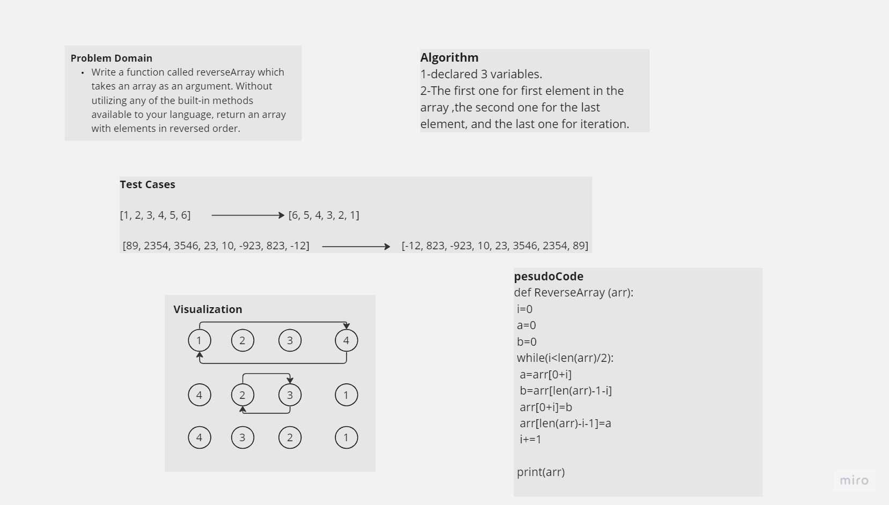

# Challenge Title
Reverse an array
Function that take an array and return the array but reversed

## Whiteboard Process

## Approach & Efficiency
BigO O(N)

## Solution
python array-reverse.py

Ex:

def ReverseArray (arr): 

 i=0

 a=0

 b=0

 while(i<len(arr)/2):
  a=arr[0+i]
  b=arr[len(arr)-1-i]
  arr[0+i]=b
  arr[len(arr)-i-1]=a
  i+=1

 print(arr)

l = ['n','5','f','a']

ReverseArray(l)

Output: ['a','f','5','n']