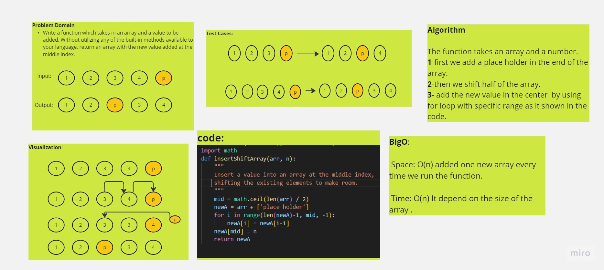

# Challenge Title
Array insert shift

Function that takes an array and a value then Insert a value into an array at the middle index.
    

## Whiteboard Process

## Approach & Efficiency
BigO 

Space: O(N) added one new array every time we excute the function

Time: O(n)  depend on the array size

## Solution
python array-insert-shift.py

Ex:

import math

def insertShiftArray(arr, n):

    """
    Insert a value into an array at the middle index,
    shifting the existing elements to make room.
    """
    
    mid = math.ceil(len(arr) / 2)  

    newA = arr + ['place holder']  

    for i in range(len(newA)-1, mid, -1):

        newA[i] = newA[i-1]  

    newA[mid] = n  

    return newA
