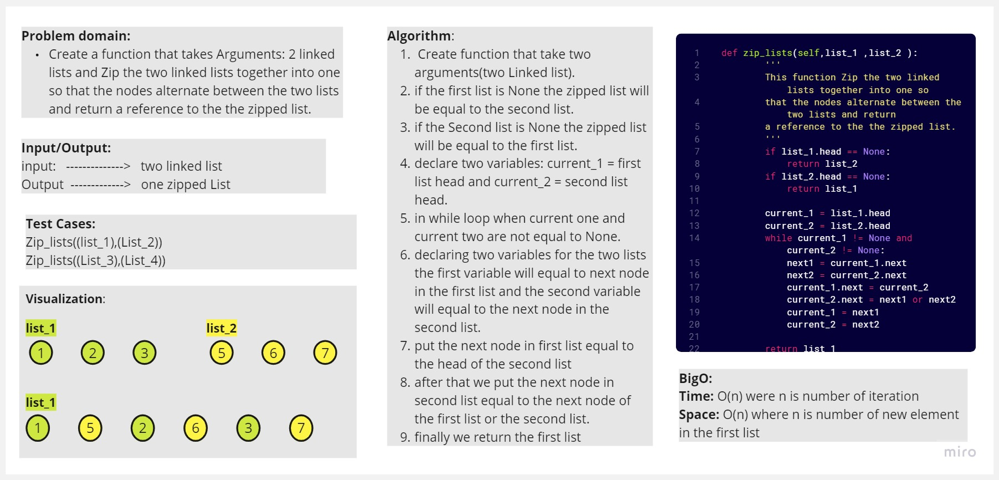

# Singly Linked Lists
Creating singly linked list with properites and methods to insert nodes to the list , showing all list nodes and finding the kth node from the tail in the linked list, zipped two linked list in one list.

## Whiteboard Process
>Normal insert

>Adding

>Insert_befor

>Insert_after

>kth_from_end

>Zipped linked list

## Approach & Efficiency

BigO:
```
### Normal insert:

time: O(1)
space: O(1)

### adding ,insert_befor and insert_after

time: O(n) where n the iteration number until we find the specific value
space: O(1)

### kth_from_end:

time: O(n) where n the number of iteration depend on k
space: O(1)

### Zipped linked list

Time: O(n) were n is number of iteration
Space: O(n) where n is number of new element in the first list

```
## Solution
``` python
def insert(self,value):

        new_node = Node(value)

        new_node.next = self.head

        self.head = new_node

def append(self,new_value):
       '''
       adds a new node with the given value to the end of the list
       '''
       
       current = self.head
       while current :
          if current.next == None:
            current.next = Node(new_value)
            return 
             
          current = current.next

def insert_before(self,value,new_value):
        '''
        adds a new node with the given new value immediately before the first node that has the value specified
        '''
        new_node = Node(new_value)
        current = self.head

        # Check if the list is empty
        if self.head is None:
            self.head = new_node
            return

        if current.value == value:
           new_node.next = self.head
           self.head = new_node
           return 

        while current.next:
           if current.next.value == value:
            new_node.next = current.next
            current.next = new_node
            return
           current = current.next
        
def insert_after(self,value,new_value):
       '''
       adds a new node with the given new value immediately 
       after the first node that has the value specified
       '''
       new_node = Node(new_value)
       current = self.head

       if self.head is None:
            self.head = new_node
            return

       while current :
          if current.value == value:
             new_node.next = current.next
             current.next = new_node
             return
          current = current.next

def kth_from_end(self,k):
        '''
        function that take argument: a number, k,
        as a parameter and Return the node’s value 
        that is k places from the tail of the linked list.
        '''

        length = 0
        current = self.head
        while current:
            length += 1
            current = current.next
        
        if k >= length :
           return "Out of range"
        
        if k < 0 :
           return "Please inter a positive index"
        
        round = length - k -1
        current = self.head

        while round != 0 :
           current = current.next
           round-=1
        return current.value
    

           
def linkedlist_middle (self):       # Stretch Goal
        '''
        function that return the value of
        the node in the middle of the linked
        list
        '''
        length = 0
        current = self.head
        while current:
            length += 1
            current = current.next
        length = length//2

        current = self.head
        while length != 0 :
           current = current.next
           length -=1
        return current.value

def zip_lists(self,list_1 ,list_2 ):
        '''
        This function Zip the two linked lists together into one so 
        that the nodes alternate between the two lists and return 
        a reference to the the zipped list.
        '''
        if list_1.head == None:
            return list_2
        if list_2.head == None:
            return list_1
        
        current_1 = list_1.head
        current_2 = list_2.head
        while current_1 != None and current_2 != None:
            next1 = current_1.next
            next2 = current_2.next
            current_1.next = current_2
            current_2.next = next1 or next2
            current_1 = next1
            current_2 = next2

        return list_1
```

