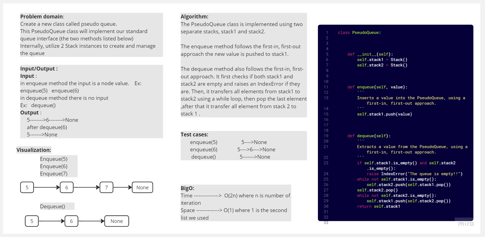

# Stack queue pseudo


## Whiteboard Process



## Approach & Efficiency
BigO:

Time --------------->  O(2n) where n is number of iteration in the loops for the two stacks

Space --------------> O(2n) where n is the number of element in each stack

## Solution
```py
class PseudoQueue:

    def __init__(self):
        self.stack1 = Stack()
        self.stack2 = Stack()

    def enqueue(self, value):
        '''
        Inserts a value into the PseudoQueue, using a first-in, first-out approach.
        '''
        self.stack1.push(value)

    def dequeue(self):
        '''
        Extracts a value from the PseudoQueue, using a first-in, first-out approach.
        '''
        if self.stack1.is_empty() and self.stack2.is_empty():
            raise IndexError("The queue is empty!!")
        while not self.stack1.is_empty():
            self.stack2.push(self.stack1.pop())
        self.stack2.pop()
        while not self.stack2.is_empty():
            self.stack1.push(self.stack2.pop())
        return self.stack1
```